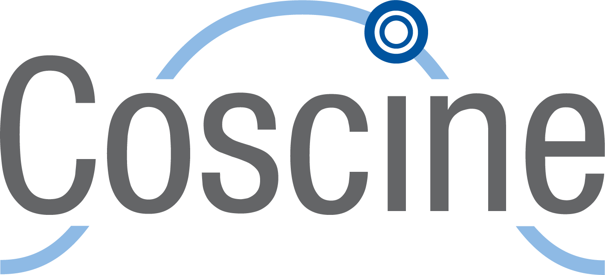
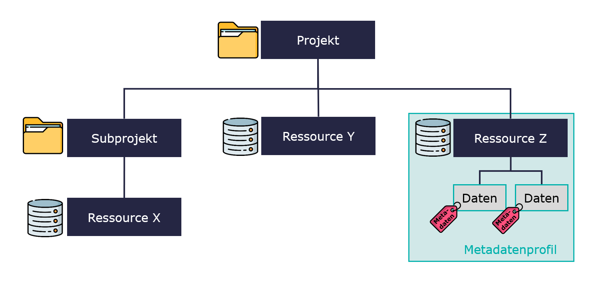

# Coscine


**Inhalte**  

In diesem Kurs werden Ihnen die ersten Schritte mit Coscine nähergebracht.
Sie lernen den gesamten Workflow rund um die Weboberfläche kennen, sodass Sie in der Lage sind, die Plattform für Ihr nächstes Forschungsprojekt zu nutzen.
Es gibt verschiedene Möglichkeiten Coscine zu nutzen.
Der Fokus in diesem Kurs liegt ausschließlich auf der Weboberfläche und zielt darauf ab, grundlegende Funktionen zu vermitteln.
Die Kapitel greifen Inhalte der [Coscine Dokumentation](https://docs.coscine.de/de) auf, die vom [IT Center der RWTH Aachen University](https://www.itc.rwth-aachen.de/cms/it-center/services/forschung/~smhwy/coscine/) zur Verfügung gestellt wird.

> Coscine wird am IT Center der RWTH Aachen laufend weiterentwickelt und verbessert, weshalb einige Inhalte dieses Kurses vom aktuellen Entwicklungsstand abweichen können. Die Inhalte beziehen sich auf den Entwicklungsstand von Oktober 2024.

**Aufwand**  

Abhängig davon, wie intensiv Sie den Kurs bearbeiten, beläuft sich die Dauer auf maximal 1 Stunde (wenn Sie die Texte aufmerksam lesen und die Übungsaufgaben bearbeiten).

---

> **Über den Kurs**
>
> Dieser Selbstlernkurs wurde an der FH Aachen im Rahmen des Projektes [Persist\@HAW](https://www.fh-aachen.de/forschung/forschungsfoerderung/forschungsdatenmanagement-fdm) (FK: 16FDFH129), gefördert vom BMFTR und der EU (NextGenerationEU), erstellt. Ziel des Projektes ist es, Forschungsdatenmanagement (FDM) an der FH Aachen zu etablieren und erstellte Konzepte und Materialien für andere HAW übertragbar und nachnutzbar zu machen.
> 
>
> Nutzungshinweis und Feedback
>
> Der Kurs baut auf den Inhalten des bereits veröffentlichten [Workshop-Konzepts](https://doi.org/10.5281/zenodo.12804571) auf und befindet sich aktuell noch in einer Testphase. Teilen Sie uns gerne Ihre Meinung zum Kurs mit.
>
> Dieses Werk ist lizenziert unter einer [Creative Commons Namensnennung 4.0 International Lizenz](https://creativecommons.org/licenses/by/4.0/deed.de).
>
> **Zitation**
>
> Birmans, K., Tambornino, P., & Ullrich, A. V. (2024, November 18). Coscine Basics - Selbstlernkurs. Zenodo. https://doi.org/10.5281/zenodo.14177947

# Was ist Coscine?

Coscine ist eine Forschungsdatenmanagement-Plattform, die es ermöglicht, Daten im Sinne der FAIR Prinzipien (**F**indable, **A**ccessible, **I**nteroperable & **R**eusable) kostenlos für bis zu 10 Jahre nach Projektende zu speichern.
Coscine greift auf den DataStorage.nrw zu - ein sehr sicherer Speicher, der an den vier Standorten Aachen, Duisburg-Essen, Köln und Paderborn betrieben wird.
Seit 2018 wird Coscine an der RWTH Aachen entwickelt. 

**Die wichtigsten Funktionen**

 - Daten speichern: Pro Projekt können bis zu 125 TB Speicherplatz beantragt werden. 100 GB pro Projekt können Sie ohne einen Antrag nutzen.
 - Daten beschreiben: Alle Daten müssen mit Metadaten (Informationen über die Daten) beschrieben werden, damit sie nachvollziehbar bleiben.
 - (Meta-)Daten teilen: Metadaten können öffentlich sichtbar (innerhalb von Coscine) eingestellt werden. Die Daten selbst sind nicht frei zugänglich, können jedoch für ausgewählte Personen (z.B. Projektpartner:innen) zugänglich gemacht werden. Alle anderen können eine Anfrage per E-Mail versenden.

**Die Struktur**

 - (Sub-)Projekte: Es können beliebig viele (Sub-)Projekte erstellt werden. Sie helfen dabei, den Überblick zu behalten. Vergleichen können Sie das mit der Ordnerstruktur auf Ihrem Computer. 
 - Ressourcen: Hier legen Sie fest, wie und wo Ihre Daten gespeichert werden. Es gibt 5 Ressourcentypen die im Kapitel "Ressourcen und Metadatenprofile" genauer beschrieben werden.
 - Metadatenprofil: Ein Metadatenprofil ist immer an eine Ressource gebunden. Es gibt den Rahmen vor, mit welchen Informationen die Daten beschrieben werden, z.B. Erhebungsdatum, Erhebungsmethode. 



# Login und Profil

**Login-Möglichkeiten**

 - Per Login (All Institutions): Steht Coscine an Ihrer Hochschule zur Verfügung, können Sie sich mit Ihren Institutions-Anmeldedaten anmelden. Diese verfallen nach Beschäftigungsende. Deshalb sollten Sie Ihr Konto mit einer ORCiD verknüpfen, um dauerhaft auf Ihre Projekte zugreifen zu können. 
 - Per ORCiD: Die ORCiD ist eine eindeutige, digitale Identifikation für Forschende. Eine ORCiD besteht aus einem 16-stelligen numerischen Code. Der Login mit der ORCiD ist jederzeit möglich.

> Legen Sie sich mit nur wenigen Klicks eine [ORCiD](https://orcid.org/register) an.

**Profileinstellungen**

|||
|Persönliche Angaben    | Titel, Vorname, Familienname, E-Mail, Organisation, Disziplin (vgl. Spalte „Fachkollegium“ der [DFG-Fachsystematik](https://www.dfg.de/resource/blob/172316/5863ef132d178054609f74940f6a27c9/fachsystematik-2016-2019-de-grafik-data.pdf))|
|Zugriffstoken erstellen| Ermöglicht den automatisierten Zugriff auf alle Projekte und Dateien über die API. Mehr dazu in der [Coscine Dokumentation](https://docs.coscine.de/de/token/).|
|Nutzendenpräferenzen   | Einstellung der bevorzugten Sprache (deutsch oder englisch)|
|Verbundene Accounts    | Verknüpfung des Kontos mit anderen Accounts (z.B. ORCiD)|

> **Übung**
>
> **Falls Speicherplatzressourcen an Ihrer Institution verfügbar sind:** 
>
> - Melden Sie sich bei [Coscine](https://coscine.rwth-aachen.de/login) an. Nutzen Sie den Login (All Institutions). 
> - Öffnen Sie Ihr Profil und vervollständigen Sie die fehlenden Informationen.
>
> **Falls Speicherplatzressourcen an Ihrer Institution ~~nicht~~ verfügbar sind:**
>
> - Melden Sie sich bei [Coscine](https://coscine.rwth-aachen.de/login) mit Ihrer [ORCiD](https://orcid.org/) an. 
> - Öffnen Sie Ihr Profil und vervollständigen Sie die fehlenden Informationen.

# Projekte und Unterprojekte

Projekte sind sozusagen die Ordner, in denen später sogenannte Ressourcen und darin Ihre Daten gespeichert sind. In einem Projekt können auch mehrere Subprojekte vorhanden sein. Damit verständlich ist, um welches Projekt es sich handelt, müssen Sie beim Erstellen verschiedene Informationen angeben: 

|||
|Projektname | Name des Projektes |
|Anzeigename | Kurztitel des Projektes |
|Projektbeschreibung | Kurze Erläuterung des Projektinhaltes |
|Principal Investigators (PI) | Projektleiter:innen |
|Projektstart | Start des Projektes |
|Projektende | (Voraussichtliches) Projektende |
|Disziplin | Entspricht der [DFG-Fachsystematik](https://www.dfg.de/resource/blob/172316/5863ef132d178054609f74940f6a27c9/fachsystematik-2016-2019-de-grafik-data.pdf) (Mehrfachauswahl möglich) |
|Teilnehmende Organisationen | Verfügbare Organisationen basieren auf [ROR IDs](https://ror.org/). Falls die Organisation nicht gelistet ist, kann sie manuell eingegeben werden. |
|Projektschlagwörter | Zur besseren Einordnung und Suchbarkeit des Projektes |
|Sichtbarkeit der Metadaten | Public heißt: alle Nutzenden können die (Meta-)Daten in Coscine finden. Kein Zugriff auf die Daten. Anfrage zum Teilen der Daten möglich. |
| GrantID | Fördernummer des Projektes (falls vorhanden)|

> **Übung**  
>
> Erstellen Sie Ihr eigenes Test-Projekt in Coscine. Verwenden Sie bei Bedarf folgende Metadaten.
>
> ```
> Projektname: Verkehrsanalyse und Optimierung im Aachener Verkehrsverbund
>
> Projektbeschreibung: Das Forschungsprojekt "Verkehrsanalyse und Optimierung im Aachener Verkehrsverbund" zielt darauf ab, durch die Analyse von umfangreichen  Daten des Verkehrssystems in Aachen Lösungsansätze für eine effizientere und benutzerfreundlichere Nutzung des öffentlichen Nahverkehrs zu entwickeln. Das Projekt umfasst die Sammlung und Integration verschiedener Datensätze, darunter Informationen zu Haltestellen, Masten sowie Tarifbedingungen, die in einer zentralen Plattform gespeichert und analysiert werden. Ziel ist es, die Effizienz des öffentlichen Nahverkehrs im Aachener Raum zu steigern, die Umweltbelastung zu reduzieren und gleichzeitig die Lebensqualität der Bewohner:innen zu verbessern.
>
> Projektleiter:in: [Sie]
>
> Projektstart: [Heute]
>
> Projektende: [Heute + 2 Jahre]
>
> Teilnehmende Organisationen: [Ihre Hochschule]
>
> Förderkennzeichen: XYZ-ABC123
> ```

# Ressourcen und Metadatenprofile

In diesem Kapitel lernen Sie, wie Sie eine Ressource erstellen.

{{1-2}}
***
**Schritt 1: Ressourcentyp festlegen**  

Mit dem Ressourcentyp legen Sie fest, wo Ihre Daten gespeichert sein sollen. So gibt es z.B. die Möglichkeit, Daten über Coscine auf dem DataStorage.nrw zu speichern oder nur einen Datensatz zu verlinken, der bereits an einem anderen Ort gespeichert ist (z.B. GitLab).

|||
| Web | Web-Ressource des Datastorage.nrw. Bis zu 100 GB Speicherplatz ist kein Antrag erforderlich. Auf Antrag auch mehr Speicherplatz möglich. Zugriff nur über Webinterface oder API. Dies ist der "Standard" Ressourcentyp wenn Ihre Daten in Coscine gespeichert werden. |
| S3 | S3-Ressource des Datastorage.nrw. Für die S3-Ressource muss ein Antrag gestellt werden. Es sind bis zu 125 TB Speicherplatz pro Speicherplatz-Antrag möglich. Zugriff erfolgt über Webinterface, API oder S3-Client. |
| WORM | WORM-Ressource des Datastorage.nrw für besonders vor Manipulation zu schützende Daten. Daten können nach dem Speichern nicht mehr gelöscht oder verändert werden (Write Once Read Many). Für die WORM-Ressource muss ein Antrag gestellt werden. Es sind bis zu 125 TB Speicherplatz möglich. Dieser Typ ist nur in Sonderfällen relevant. Beraten Sie sich mit ihrem lokalen Coscine Support wenn Sie überlegen eine WORM Ressource zu beantagen. |
| GitLab | Sie können ein GitLab-Projekt mit Coscine verknüpfen und so alle Dateien, die im GitLab Projekt liegen, in Coscine mit Metadaten beschreiben. Die Daten verbleiben weiterhin in GitLab, die Metadaten werden in Coscine gespeichert. Da bei dieser Resource die Daten selbst nicht in Coscine gespeichert werden kann sie auch genutzt werden wenn Sie nicht Teil einer Institution sind, die Speicher in Coscine zur Verfügung stellt. |
| Linked Data | Sie können Dateien, die an einem anderen Speicherort liegen, mit einem persistenten Link in Coscine verknüpfen und dort die Dateien mit Metadaten beschreiben. Auch hier bleiben die Daten am ursprünglichen Speicherort. Da bei dieser Resource die Daten selbst nicht in Coscine gespeichert werden kann sie auch genutzt werden wenn Sie nicht Teil einer Institution sind, die Speicher in Coscine zur Verfügung stellt. |
***

{{2-3}}
***
**Schritt 2: Metadatenprofil festlegen**

Im zweiten Schritt wählen Sie ein Metadatenprofil. Dies bestimmt die Eingabefelder für die Metadaten (z.B. Ersteller:in, Erhebungsmethode, Datentyp, Lizenz…). Einige Profile und Standards sind in Coscine bereits vorgegeben (z.B. BASE oder EngMeta). Wenn Sie kein passendes Profil für Ihre Daten finden, dann können Sie auch ein eigenes erstellen und beantragen.

> Hinweis: Das ausgewählte Metadatenprofil kann im Nachgang nicht mehr geändert werden. Wenn Sie das Profil später wechseln wollen müssen Sie die Resource löschen und von vorne beginnen. Es lohnt sich also, sorgfältig zu planen.
***

{{3-4}}
***
**Schritt 3: Ressourcenmetadaten ausfüllen** 

Im letzten Schritt müssen Sie nun noch ein paar Informationen über die Ressource eingeben: 

|||
| Ressourcenname | Eindeutiger Name der Ressource |
| Anzeigename | Kurzer Anzeigename der Ressource |
| Ressourcenbeschreibung | Beschreibung von Inhalt und Zweck der Ressource |
| Disziplin | Entspricht der [DFG-Fachsystematik](https://www.dfg.de/resource/blob/172316/5863ef132d178054609f74940f6a27c9/fachsystematik-2016-2019-de-grafik-data.pdf) (Mehrfachauswahl möglich) |
| Projektschlagwörter | Zur besseren Einordnung und Suchbarkeit der Ressource |
| Sichtbarkeit | Bei der Einstellung „public“ können alle Nutzenden von Coscine die (Meta-)Daten finden. Sie haben keinen Zugriff auf die Daten selbst, können Sie jedoch bei Interesse kontaktieren. |
| Lizenz | Für alle Dateien der Ressource kann eine Lizenz ausgewählt werden. Für Forschungsdaten werden die Creative Commons Lizenzen (CC-Lizenzen) empfohlen. Weitere Infos finden Sie auf [forschungsdaten.info](https://forschungsdaten.info/themen/rechte-und-pflichten/forschungsdaten-veroeffentlichen/creative-commons-lizenzen/). |
| Interne Regeln zur Nachnutzung | Besondere Regeln und Informationen zur Nachnutzung der Dateien innerhalb der Organisation (z.B. Wie soll mit den Daten umgegangen werden, wenn der/die Projektleiter:in nicht mehr da ist?) |
***

{{4}}
***
> **Übung** 
>
> **Falls Speicherplatzressourcen an Ihrer Institution verfügbar sind:** 
>
> - Erstellen Sie in Ihrem Projekt eine Ressource vom Typ „Web“. Verwenden Sie bei Bedarf die unten aufgeführten Metadaten.
> - Verwenden Sie das Metadatenprofil „Base Profile“.
>
> **Falls Speicherplatzressourcen an Ihrer Institution ~~nicht~~ verfügbar sind:**
>
> - Erstellen Sie in Ihrem Projekt eine Ressource vom Typ „Linked Data“. Verwenden Sie bei Bedarf die unten aufgeführten Metadaten.
> - Verwenden Sie das Metadatenprofil „Base Profile“.
>
> ```
> Ressourcenname: Basisdaten
>
> Ressourcenbeschreibung: Der Datensatz enthält alle Haltestellen im AVV-Verbundgebiet auf Ebene der Masten, soweit verfügbar mit GlobalID. Es sind nur Haltestellen in der Städteregion Aachen, dem Kreis Düren und dem Kreis Heinsberg enthalten. Die Koordinaten sind im Format Gauß-Krüger 2 (EPSG:31466) gepflegt.
>
> Sichtbarkeit der Metadaten: Project Members
>
> Lizenz: CC BY 4.0 (Attribution)
>
> Interne Regeln zur Nachnutzung: Keine
> ```
***

# Dateiupload, -download und -löschung
In diesem Kapitel lernen Sie, wie Sie Forschungsdaten hochladen, herunterladen, löschen und filtern können.

**Upload**

Sofern Sie eine "Web" Ressource erstellt haben, können Sie nun Daten über Coscine hochladen. Sie können entweder einzelne Dateien hochladen oder auch mehrere Dateien auf einmal. Ziehen Sie die Dateien einfach in die Weboberfläche von Coscine oder laden Sie die Dateien über die Buttons "Datei auswählen" und "Hochladen" hoch. Sobald Sie Ihre Daten ausgewählt haben, müssen Sie diese rechts mit Metadaten beschreiben. Danach können Sie die Daten final hochladen.

Wenn Sie eine "Linked Data" Ressource erstellt haben, können Sie keine Daten direkt in Coscine hochladen. Stattdessen verlinken Sie Daten, die in einer anderen Speicherumgebung gespeichert sind. Anschließend beschreiben Sie diese mit Metadaten. Nur die Metadaten sind nun in Coscine hinterlegt. Neben diesen beiden Varianten besteht auch die Möglichkeit, Daten automatisiert über die API hochzuladen oder über den S3-Client, wenn Sie eine S3-Ressource gewählt haben. Weitere Informationen zur [API](https://docs.coscine.de/de/api/api/) und zu [S3-Clients](https://docs.coscine.de/de/resources/s3-clients/) finden Sie in der Coscine-Dokumentation.

**Download und Löschen**

Beim Download gilt das Gleiche wie beim Upload: Da die Daten bei der "Linked Data" Ressource extern gespeichert sind, können die Daten nicht in Coscine heruntergeladen werden. Inhalte von "Web", "S3", und "WORM"-Ressourcen können Sie hingegen herunterladen, indem Sie die gewünschten Daten über die Checkbox markieren, anschließend "Alle Dateien" auswählen und anschließend rechts auf "Herunterladen" klicken. 

Um Daten einer "Web" Ressource zu löschen, klicken Sie nach der Auswahl auf den Pfeil neben "Herunterladen", anschließend auf "Alle Dateien" und dann auf "Löschen". Bei Inhalten einer "Linked Data" Ressource gehen sie identisch vor. Allerdings entfernen Sie nicht den Datensatz (da sich dieser an einem externen Speicherort befindet), sondern nur die Verlinkung und die zugehörigen Metadaten.

> Hinweis: Gelöschte Inhalte können nicht wieder hergestellt werden.

**Filtern**

Über das Filtersymbol können Sie festlegen, welche Metadatenfelder in der Auflistung angezeigt werden sollen. Über die Suchleiste oberhalb der Liste können Sie nach Schlagwörtern suchen. Dies ist nützlich, wenn Sie beispielsweise alle Daten sehen möchten, die z.B. mit einer bestimmten Methode erhoben wurden. Dies setzt natürlich voraus, dass die Metadaten konsistent dokumentiert wurden.

> **Übung**
>
> **Falls Speicherplatzressourcen an Ihrer Institution verfügbar sind:** 
>
> - Laden Sie einen Datensatz in Ihrer "Web" Ressource hoch und füllen Sie die Metadaten aus.
> - Machen Sie sich mit der Filterfunktion vertraut.
>
> **Falls Speicherplatzressourcen an Ihrer Institution ~~nicht~~ verfügbar sind:**
>
> - Verlinken Sie einen Datensatz (der z.B. in [Sciebo](https://hochschulcloud.nrw/) gespeichert ist) in Ihrer "Linked Data" Ressource und füllen Sie die Metadaten aus.
> - Machen Sie sich mit der Filterfunktion vertraut.

# Dateien Suchen

In diesem Kapitel lernen Sie, wie sie in Coscine nach Inhalten suchen können und unter welchen Bedingungen dies möglich ist.

Über die Suchfunktion können Dateien, Ressourcen und Projekte mithilfe der Metadaten gefunden werden. Dies setzt voraus, dass die Metadaten "public" sind. Wenn Metadaten "privat" sind, müssen Sie Mitglied des Projekts sein, um Daten aus dem Projekt finden zu können.  

Der Zugriff auf die Ergebnisse ist nur möglich, wenn Sie Mitglied des Projektes sind. Alle anderen haben keinen Zugriff auf die Daten selbst und sehen nur die Metadaten.

> Hinweis: Die Daten können erst 24 Stunden nach Upload in Coscine gefunden werden, da sich das System in diesem Rhythmus aktualisiert.

> **Übung**
>
> Testen Sie die Suchfunktion mit Schlagwörtern Ihrer Wahl.

# Zugriffsrechte verwalten

In diesem Kapitel lernen Sie die Rechteverteilung in Coscine kennen. Sie lernen, wie sie Personen zu einem Projekt hinzufügen können und welche Rollen sie diesen Personen geben können.

Es gibt zwei Möglichkeiten Personen zu einem Projekt hinzuzufügen:

1. Navigieren Sie in der Projektübersicht zur "Mitgliederverwaltung". Per E-Mail-Adresse können Sie Personen hinzufügen. Mitglieder der Institution sind bereits im System erfasst und können einfach per Namen gesucht werden. Auch externe Personen können eingeladen werden. Diese benötigen für den Login eine ORCiD. Anschließend können sie über die im Profil hinterlegte E-Mail-Adresse eingeladen werden.
2. Übertragen Sie Mitgliederlisten aus anderen Projekten. Klicken Sie hierfür in der Mitgliederverwaltung auf "Importieren". Wählen Sie das entsprechende Projekt aus, dessen Mitglieder Sie übertragen möchten. Anschließend können Sie die Liste bearbeiten und Personen entfernen. 

Eingeladene Personen können verschiedene Rollen im Projekt besitzen:

 - **Owner** haben administrative Rechte für das Projekt und besitzen Lese- und Schreibrechte für die Daten, d.h. Sie können die Daten sowohl ansehen als auch bearbeiten.
 - **Member** haben keine administrativen Rechte. Sie haben jedoch Lese- und Schreibrechte.
 - **Guests** haben nur das Recht, Daten anzusehen. Sie besitzen weder administrative Rechte noch Schreibrechte.

> **Übung**
>
> Laden Sie eine Person Ihrer Wahl (nach Absprache) zu einem Projekt ein. Wenn Sie die Möglichkeit haben, selbst zu einem Projekt eingeladen zu werden, lassen Sie sich einladen.

# Ende

Liebe Teilnehmer:innen!

Wir hoffen, dass Ihnen dieser Selbstlernkurs dabei geholfen hat, Coscine besser zu verstehen. Natürlich gibt es über den Kurs hinweg noch weitere Funktionen und Möglichkeiten, die hier bewusst nicht vorgestellt werden. Wenn Sie sich für weitere Themen, z.B. für automatisierte Uploadmöglichkeiten interessieren, dann können wir Ihnen die [Coscine Dokumentation](https://docs.coscine.de/de/) empfehlen.